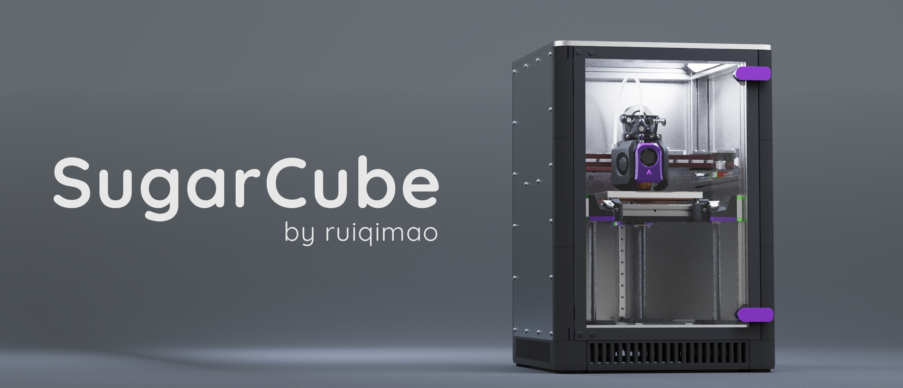
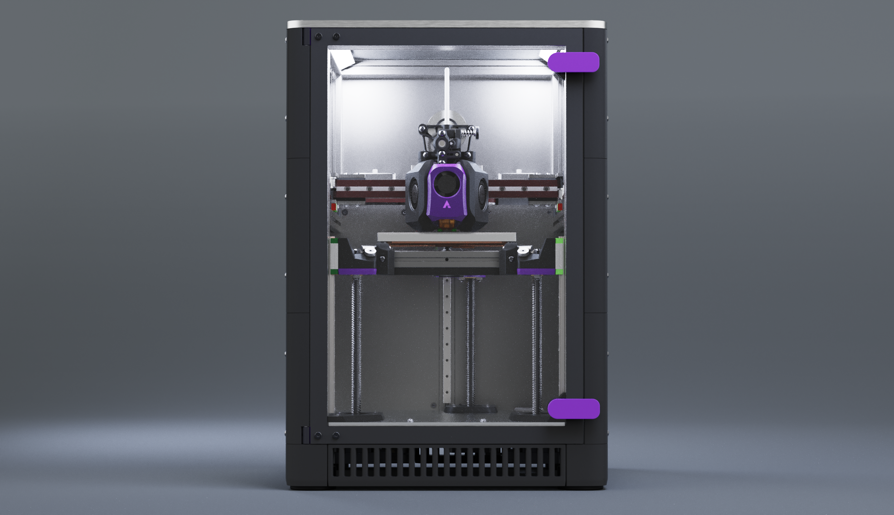

SugarCube is a compact, fully enclosed 3D printer, featuring:

* 120mm x 120mm x 120mm build space
* 153030 based frame
* CoreXY kinematics
* Kinematic triple Z
* Metal sandwich gantry
* NEMA17 XY motors
* Compatible with [Archetype toolhead ecosystem](https://github.com/Armchair-Heavy-Industries/Archetype)

## Dimensions

### Travel area
* Archetype Blackbird: 126mm x 122mm

### Outer dimensions

* Panel to panel: 272mm x 272mm x 395 mm
* With door handles and reverse bowden: 272mm x 288mm x 395mm

## BOM

Bill of materials can be found at [BOM.md](BOM.md).

## Acknowledgements

* @hartk for the renders

## License

SugarCube is licensed under CC-BY-NC-SA-4.0. More details can be found at [LICENSE.md](LICENSE.md) and [https://creativecommons.org/licenses/by-nc-sa/4.0/](https://creativecommons.org/licenses/by-nc-sa/4.0/).

If you are interested in selling parts for SugarCube, please contact @ruiqimao on Discord.

 

